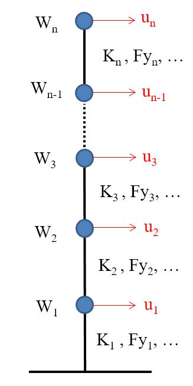

# Time History Analysis of MDOF systems: THAMDOF

THAMDOF is an educational stand-alone Matlab GUI for performing simplified nonlinear time history analyses (THA) of multiple-degree-of-freedom (MDOF) systems. The solution algorithm consists in Newmark's constant acceleration method, with Newton-Raphson iterations (Chopra 4th Edition, Table 16.3.3).

# Simplified model

THAMDOF uses a shear-building lumped-mass model of the MDOF system, with masses lumped at the floor levels. Each story lateral hysteretic model consists in a tri-linear model. P-\Delta effects can be included.
The user inputs the model information through a .csv file. An example of this file is provided for reference.

  

# Ground motions

The user inputs the set of ground motion records to be analyzed and their scale factor through a .csv file. An example of this file is provided for reference.
THAMDOF has two options for the user:
  (1) Analyzing every ground motion at the specified scale factor
  (2) Scale every ground motion in order to obtain the scale factor that results in collapse

# Outputs

THAMDOF provides visualization of several responses. Also, it is capable of producing a video of the structural response under a given ground motion.
The user can export different outputs from THAMDOF:
  (1) Max and Min values of displacement, interstory displacement, interstory drift ratio (IDR), residual interstory displacement, residual IDR, absolute velocity, interstory velocity, total acceleration, and story restoring force of each floor, during every ground motion
  (2) Time history series of IDR and story restoring force 
  (3) Scale factors that produce collapse
Results are exported in a .xlsx file.

# Other information

I developed this tool initially on 2015 for the course CEE385-Performance Based Earthquake Engineering (as its TA), thought by Professor Miranda at Stanford. Since then, every year it has suffered some minor modifications. If you have any recommendation for new features (especially a new name, hehe), don't hesitate in sharing them with us. 
I'm currently working on a Python version of this tool as well.

This tool is distributed in the hope that it will be useful, but WITHOUT ANY WARRANTY; without even the implied warranty of MERCHANTABILITY or FITNESS FOR A PARTICULAR PURPOSE.
